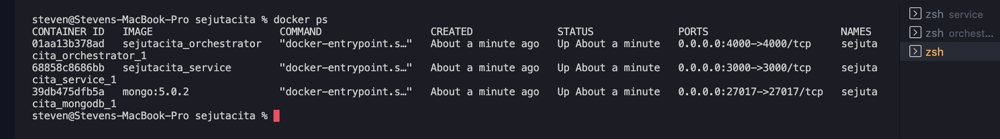

## How to run local with docker

1. install docker & docker compose

```
https://docs.docker.com/get-started/
```

2. run docker-compose command

```
docker-compose up -d
```

3. check if container is running

```
docker-compose ps
```

4. if you see result like this you are good to go



5. go to browser and access

```
http://localhost:4000 (orchestrator / gateway)

http://localhost:3000 (service)
```

6. enjoy
